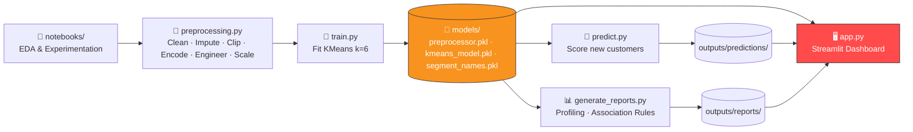
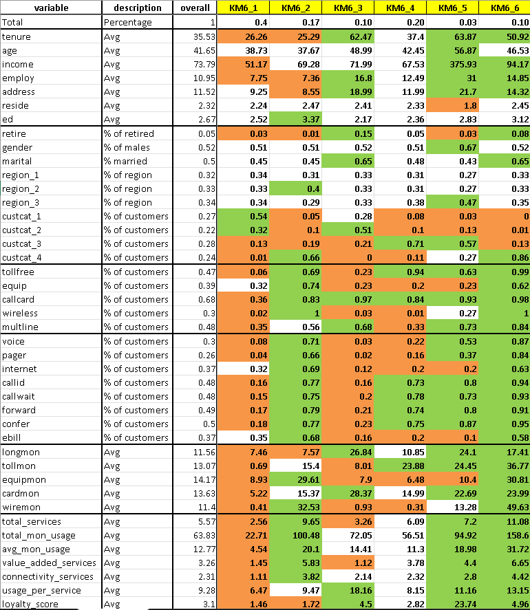

<div align="center">

<h1> 📡Telecom Customers Segmentation Project </h1>


<br/>

**An end-to-end customer intelligence platform that segments telecom customers into six behavioural groups, uncovers service cross-sell opportunities through association rule mining, and ships as a production-ready `train → predict → report → app` pipeline.**

<br/>


</div>

---

## 📑 Table of Contents

<details>
<summary>Click to expand</summary>

- [Demo](#-demo)
- [Problem Statement](#-problem-statement)
- [Key Results](#-key-results)
- [Project Architecture](#-project-architecture)
- [Repository Structure](#-repository-structure)
- [Dataset](#-dataset)
- [Methodology](#-methodology)
- [Customer Behavioral Characteristics](#-customer-behavioral-characteristics)
- [Service Affinities & Cross Selling Strategy](#-service-affinities-&-cross-selling-strategy)    
- [Strategic Insights](#-strategic-insights)
- [Implementation Strategy](#-implementation-strategy)
- [Installation](#-installation)
- [Usage](#-usage)
- [Tech Stack](#-tech-stack)
- [Limitations](#-limitations)
- [License](#-license)
- [Author / Contact](#-author--contact)

</details>

---

## 🎬 Demo

<div align="center">
  

  <br><br>

  <a href="https://teleinsight.streamlit.app/" target="_blank">
    
  </a>
  <br><br>
  <sub>
    Upload a customer CSV → Get instant customer segments, KPIs, interactive business dashboards, and downloadable reports.
  </sub>
</div>
 
---

## 🧩 Problem Statement

A telecom operator had ~1,000 active customers and no structured way to understand who they were beyond raw demographics. Marketing was undifferentiated — one message, one channel, one offer for everyone. The goal: **segment customers by behaviour**, identify which services are adopted together, and turn both into a concrete plan to grow revenue, cross-sell smarter, and protect the most valuable accounts.

---

## 🏆 Key Results

At a glance, this project delivers:

- 👥 **6 customer behavioural segments** — from Basic Customers to Premium Loyal Customers, each profiled by income, tenure, usage, and service adoption ([see segments](#-customer-behavioral-characteristics))
- 🔗 **Service affinities & associations** — which services get adopted together, mined via Apriori (e.g. Wireless → Voice Mail/Pager, Lift = 3.07) ([see business insights](#-business-insights-service-affinities-cross-sell-strategy))
- 🧠 **Strategic insights** — what each segment means for revenue growth, retention, cross-sell, and digital migration ([see strategic insights](#-strategic-insights))
- 🎯 **Implementation strategy** — a prioritized, segment-by-segment action plan tied to business objectives ([see implementation strategy](#-implementation-strategy))
- ⚙️ **automated end-to-end pipeline**: retrain on new data with one command, score new customers with another, and regenerate all business reports with a third — no notebook required after day one.

*(Full detail on each of the above is in the sections below.)*

---

## 🏗️ Project Architecture



**The core idea:** train once, predict and report as many times as needed. Nothing gets re-fit on new data — every transformation the model needs (imputer, clip bounds, encoder, scaler) is fitted once in `train.py` and reused everywhere else, which is what makes this a *pipeline* and not just a notebook.

---

## 📁 Repository Structure

```
telecom_segmentation/
│
├── README.md                          # Project overview, setup, usage
├── requirements.txt                   # All dependencies
│
├── app/                                # UI / Deployment (Streamlit)
│   └── app.py                          # Interactive dashboard for predictions
│
├── assets/                             # README media
│   └── app demo.gif                        # App walkthrough GIF
│
├── business_problem/                   # Problem understanding
│   └── Telecom_Segmentation_Problem_Statement.pdf
│
├── data/                                # Input datasets
│   ├── telco.csv                        # Training data
│   └── telco_new_cust.csv               # New customer data (prediction)
│
├── models/                              # Saved artifacts (from train.py)
│   ├── kmeans_model.pkl                 # Trained KMeans model
│   ├── preprocessor.pkl                 # Fitted preprocessing pipeline
│   └── segment_names.pkl                # Cluster → business segment mapping
│
├── notebooks/                           # Development / EDA / experimentation
│   └── Telecom Segmentation Project.ipynb
│
├── outputs/                             # All generated outputs
│   │
│   ├── predictions/                     # Predictions on new data
│   │   └── pred_29-Jul-2026_03-45PM.csv
│   │
│   └── reports/                         # Business reports
│       ├── report_29-Jul-2026_03-50PM/  # Training data report
│       │   ├── profiling.xlsx
│       │   ├── telecom_association_summary.xlsx
│       │   └── segments.xlsx
│       │
│       └── report_31-Jul-2026_05-50PM/  # New-data report
│           ├── profiling.xlsx
│           ├── telecom_association_summary.xlsx
│           └── segments.xlsx
│
├── src/                                 # Core pipeline code (production-ready)
│   ├── train.py                         # Train model + save artifacts
│   ├── predict.py                       # Predict on new data
│   ├── preprocessing.py                 # Custom preprocessing class
│   └── generate_reports.py              # Business report generation
│
├── telco_project_pca_variant/           # Alternative PCA-based approach
│   ├── Telecom Segmentation pca version.ipynb
│   ├── Telecom Profiling pca.xlsx
│   └── loadings.xlsx
│
└── .gitignore                           # Ignore unnecessary files
```

---

## 🗃️ Dataset

**~1,000 active customers × 30 attributes**, sourced from the sample dataset provided with the business case (see `business_problem/`).

<table>
<tr><th>Group</th><th>Columns</th></tr>
<tr>
<td><b>Demographics</b></td>
<td><code>region</code>, <code>tenure</code>, <code>age</code>, <code>marital</code>, <code>address</code>, <code>income</code>, <code>ed</code>, <code>employ</code>, <code>retire</code>, <code>gender</code>, <code>reside</code></td>
</tr>
<tr>
<td><b>Services (binary flags)</b></td>
<td><code>tollfree</code>, <code>equip</code>, <code>callcard</code>, <code>wireless</code>, <code>multline</code>, <code>voice</code>, <code>pager</code>, <code>internet</code>, <code>callid</code>, <code>callwait</code>, <code>forward</code>, <code>confer</code>, <code>ebill</code></td>
</tr>
<tr>
<td><b>Usage / Monthly Spend</b></td>
<td><code>longmon</code>, <code>tollmon</code>, <code>equipmon</code>, <code>cardmon</code>, <code>wiremon</code></td>
</tr>
<tr>
<td><b>Customer Category</b></td>
<td><code>custcat</code> — used for profiling, not as a clustering input</td>
</tr>
</table>

---

## 🔬 Methodology

<details open>
<summary><b>1. EDA & Data Quality Checks</b></summary>
<br/>

`.info()`, `.describe(percentiles=...)`, and `.nunique()` on every column to understand distributions and spot problems early. Found income to be heavily right-skewed (max 1,668 vs. median 47) — flagged for the outlier-handling step, not blindly transformed.
</details>

<details>
<summary><b>2. Missing Value Handling</b></summary>
<br/>

No missing values were present in the source data — but a `SimpleImputer(strategy='median')` was still built into the pipeline, so the system doesn't break the moment real-world data *does* have gaps.
</details>

<details>
<summary><b>3. Outlier Handling — Clipped, Not Dropped</b></summary>
<br/>

Every continuous column was clipped at its 1st/99th percentile instead of deleting outlier rows. This pulls extreme values in without discarding real high-value customers — dropping them would have silently removed exactly the customers this project needed to identify.
</details>

<details>
<summary><b>4. Data Encoding</b></summary>
<br/>

`region` and `custcat` are numeric (1, 2, 3…) but nominal in nature — region 3 isn't "more" than region 1. Both were one-hot encoded so K-Means doesn't invent a fake ordering between categories.
</details>

<details>
<summary><b>5. Feature Engineering — Why, Not Just What</b></summary>
<br/>

Feeding all 30 raw columns into K-Means would let 13 binary service flags (each contributing noise, not signal) dominate the Euclidean distance calculation. Instead, 7 behavioural features were engineered:

`total_services`, `value_added_services`, `connectivity_services`, `total_mon_usage`, `avg_mon_usage`, `usage_per_service`, `loyalty_score` (tenure × income)

These compress 30 raw signals into interpretable behavioural axes — *what a customer does*, not just *what boxes are checked*.
</details>

<details>
<summary><b>6. Data Scaling</b></summary>
<br/>

`StandardScaler` applied only to columns with more than 2 unique values. Binary 0/1 flags were deliberately left unscaled — scaling them would map `{0,1}` into two arbitrary spiky values and distort distance calculations further.
</details>

<details>
<summary><b>7. PCA — Tried and Rejected 🚫</b></summary>
<br/>

PCA was explicitly tested as a dimensionality-reduction alternative to manual feature selection. It only explained **~55–60% cumulative variance** in the first few components and converted interpretable features into unreadable linear combinations — a dealbreaker for a business deliverable that needs to say *"this segment spends more on wireless,"* not *"this segment scores high on PC2."*

**Decision: rejected in favour of domain-based feature selection**, validated with correlation and VIF checks (all VIF < 5 — no multicollinearity issue). This alternative approach is preserved in [`telco_project_pca_variant/`](telco_project_pca_variant/) for comparison.
</details>

<details>
<summary><b>8. Model Building</b></summary>
<br/>

| Algorithm | Result |
|---|---|
| **K-Means** ✅ | Balanced, interpretable clusters across k = 2–14 |
| Agglomerative (Ward) | Reasonable, but less balanced than K-Means |
| DBSCAN | Highest raw silhouette (~0.51) but dumped 98% of customers into one cluster — unusable for segmentation |

**K-Means was selected** for producing consistently balanced, business-usable segments — the highest silhouette score alone is meaningless if the output can't drive a marketing decision.
</details>

<details>
<summary><b>9. Profiling — Why k = 6</b></summary>
<br/>

Selected via the elbow method (WCSS) + silhouette score, both evaluated across k = 2–14. The elbow visibly flattens after k=6, and silhouette (~0.28) peaks in a defensible range there. A modest silhouette score is expected and acceptable for real behavioural data — customers aren't cleanly separable blobs, and profiling was run and compared across **k = 3 through 7** before settling on 6 as the most business-usable split.
</details>

<details>
<summary><b>10. Association Rule Mining</b></summary>
<br/>

Ran **Apriori + association rules** (`mlxtend`) on the 13 binary service columns to discover which services are adopted together — directly informing bundle design instead of guessing at cross-sell pairs.
</details>

---

## 👥 Customer Behavioral Characteristics 

<div align="center">

| Segment | Share | One-line Behaviour |
|---|:---:|---|
| 🟠 **Basic Users** | 40% | Entry-level customers with minimal engagement |
| 🟢 **Wireless & Tech Enthusiasts** | 17% | Tech-forward, high digital usage, shortest tenure |
| 🟠 **Long-Tenure Traditional Customers** | 10% | Loyal, calling-focused, digitally absent |
| 🟡 **Value-Added Service Adopters** | 20% | High communication-feature adoption, zero wireless |
| 🔵 **VIP Customers** | 3% | Highest income & loyalty — smallest, most valuable segment |
| 🟢 **Heavy Users** | 10% | Highest spend & service count — today's revenue engine |

</div>

<div align="center">

</div>

<br/>

### 🟠 KM6_1 – Basic Customers (40%)

| Metric | Value |
|---|---|
| Avg Income | $51.17K |
| Avg Tenure | 26.3 months |
| Services Used | 2.56 |
| Monthly Spend | $22.71 |
| Loyalty Score | 1.46 |

- Largest customer segment.
- Lowest income, shortest tenure, and lowest loyalty.
- Uses only a few basic telecom services.
- Lowest monthly usage and spending.
- Limited adoption of connectivity and value-added services.
- wireless (2%), voice mail (8%), caller ID (16%), e-billing (35%).


**Behaviour:** Entry-level customers with minimal engagement.


### 🟢 KM6_2 – Connected Digital Customers (17%)

| Metric | Value |
|---|---|
| Avg Income | $69.28K |
| Avg Tenure | 25.3 months |
| Services Used | 9.65 |
| Monthly Spend | $100.48 |
| Wireless / Internet / Equipment Adoption | 100% / 69% / 74% |

- Moderate income with relatively short tenure.
- High adoption of Wireless, Internet, Equipment, Voice Mail and Pager.
- Uses nearly ten telecom services.
- High monthly usage and strong digital engagement.

**Behaviour:** Technology-oriented customers willing to adopt multiple digital services.

 
### 🟠 KM6_3 – Traditional Long-Term Customers (10%)

| Metric | Value |
|---|---|
| Avg Tenure | 62.5 months |
| Avg Age | 49.0 |
| Retired | 15% |
| Callcard Usage | 97% |
| Wireless / Internet Adoption | 3% / 12% |

- Longest-tenured customers after KM6_5.
- Older customer base with higher retirement rate.
- Heavy users of traditional calling services.
- Very low adoption of Wireless and Internet services.

**Behaviour:** Loyal but traditional customers who have been slow to adopt modern telecom services.

 
### 🟡 KM6_4 – Communication Service Users (20%)

| Metric | Value |
|---|---|
| Avg Income | $67.53K |
| Services Used | 6.09 |
| Toll-Free Adoption | 94% |
| Caller ID / Call Waiting / Forward / Confer | 73% / 78% / 74% / 75% |
| Wireless Adoption | 1% |

- Strong adoption of Toll-Free, Caller ID, Call Waiting, Call Forwarding and Conference Calling.
- Moderate income and service usage.
- Lower adoption of Wireless and Internet services.

**Behaviour:** Customers focused primarily on communication-related services.

 
### 🔵 KM6_5 – Premium Loyal Customers (3%)

| Metric | Value |
|---|---|
| **Avg Income** | **$375.93K** |
| Avg Tenure | 63.9 months |
| **Loyalty Score** | **23.74** |
| Years Employed | 31 |
| Services Used | 7.2 |

- Highest income and longest tenure.
- Exceptional loyalty score.
- Long employment history.
- High service usage across premium offerings.

**Behaviour:** Small but extremely valuable customer segment with strong purchasing power and long-term loyalty.

 
### 🟢 KM6_6 – Heavy Users (10%)

| Metric | Value |
|---|---|
| **Services Used** | **11.08 (highest)** |
| **Monthly Spend** | **$158.60 (highest)** |
| Wireless / Toll-Free / Callcard | 100% / 99% / 98% |
| Avg Income | $94.17K |

- Highest number of subscribed services.
- Highest monthly usage and spending.
- Extensive adoption of both connectivity and value-added services.
- High income with strong customer loyalty.

**Behaviour:** Heavy telecom users generating the highest revenue for the business.
 
---

## 💡 Service Affinities & Cross Selling Strategy

### Key Finding

#### 1️⃣ Wireless acts as the central service in the telecom portfolio.
- Wireless shows strong relationships with Voice Mail (0.61), Pager (0.66), Internet (0.39), and several calling services.
- Association Rule Mining also identifies Wireless as the strongest recommended service (**Lift = 3.07, Confidence = 90.96%**).

**Business Insight:** Wireless should be treated as the anchor product for bundled plans and targeted cross-selling campaigns.


#### 2️⃣ Calling features are frequently adopted together.
Strong positive relationships exist among:
- Caller ID
- Call Waiting
- Call Forwarding
- Conference Calling
- Toll-Free

Correlation values range between **0.57 and 0.65**, while association rules show confidence levels above **90%**.

**Business Insight:** Instead of promoting these services individually, they should be offered as integrated communication bundles to increase adoption.

 
#### 3️⃣ Voice Mail and Pager form a strong service combination.
Both services exhibit:
- High correlation
- High association strength (Lift = 2.99 for Pager and 2.69 for Voice)

**Business Insight:** Customers subscribing to one of these services are highly likely to adopt the other, making them excellent candidates for bundled promotions.

 
#### 4️⃣ Internet and Equipment services show strong affinity.
- Correlation between Equipment and Internet = **0.60**
- Association rules also identify strong relationships between these services.

**Business Insight:** Customers purchasing Internet services should be targeted with Equipment rental offers and related digital services.

 
#### 5️⃣ Electronic Billing is closely associated with digital services.
Electronic Billing demonstrates strong relationships with:
- Internet
- Equipment
- Wireless

**Business Insight:** Promoting e-Billing during digital service activation can improve digital adoption while reducing operational costs.

 
#### 6️⃣ Multiline service shows relatively weak associations.
Compared to other telecom services, Multiline has weaker relationships with most service categories.

**Business Insight:** Multiline appears to satisfy specific customer requirements and may require targeted marketing rather than broad cross-selling campaigns.

 
### 🏁 Overall Associations Conclusion

Apriori + association rule mining on the 13 service columns revealed that **telecom services are adopted in groups, not independently.** Three ecosystems emerged:

| Ecosystem | Services |
|---|---|
| 📶 **Wireless Ecosystem** | Wireless, Voice Mail, Pager, Internet |
| ☎️ **Communication Feature Ecosystem** | Toll-Free, Caller ID, Call Waiting, Call Forwarding, Conference Calling |
| 💻 **Digital Ecosystem** | Internet, Equipment Rental, Electronic Billing |

These findings suggest that bundled offerings and personalized cross-selling strategies are likely to be more effective than promoting individual services. Leveraging these service affinities can improve customer adoption, increase average revenue per customer (ARPU), and strengthen customer retention.

 ---
 
## 🧠 Strategic Insights

The customer segmentation analysis reveals six distinct behavioural groups with significantly different demographic profiles, service adoption patterns, and revenue potential — each pointing to a different lever the business can pull.

### 📈 Revenue Growth
**KM6_6 – Heavy Users (10%)** represent the strongest opportunity for revenue growth, with the highest service adoption (11.08 services) and highest monthly usage ($158.60) of any segment. Premium service bundles and new product launches should primarily target this group.

### 🛡️ Customer Retention
**KM6_5 – Premium Loyal Customers (3%)** contribute disproportionately high customer value despite representing only a small share of the base — a loyalty score **7.7× the overall average**. Retaining these customers should remain a top strategic priority; losing even one is a measurable revenue event.

### 🔗 Cross-Selling Opportunities
**KM6_2 – Connected Digital Customers (17%)** and **KM6_4 – Communication Service Users (20%)** together represent 37% of the base with strong potential for additional service adoption through targeted cross-selling and bundled offerings — both segments already show high adoption behaviour, just in different service categories.

### 🌐 Digital Migration
**KM6_3 – Traditional Long-Term Customers (10%)** continue to rely heavily on conventional telecom services, with wireless and internet adoption under 15%. Gradual migration toward digital and connectivity services can increase their long-term value while preserving the loyalty this segment already has.

### 🌱 Customer Development
**KM6_1 – Basic Customers (40%)** represent the largest segment but currently generate the lowest value per customer. Affordable bundled plans and introductory offers can encourage gradual service adoption and materially improve customer lifetime value — this is the single largest growth lever in the entire base.

---

## 🎯 Implementation Strategy

| Priority | Customer Segment | Business Objective | Recommended Strategy | Why It Matters |
|:---:|---|---|---|---|
| 1 | 🔵 **Premium Loyal Customers (3%)** | Customer retention | Dedicated account management, proactive check-ins, exclusive early access, VIP support and personalized offers | A single customer here carries ~7.7× the loyalty value of an average customer — losing one is a measurable revenue event |
| 2 | 🟡 **Communication Service Users (20%)** | Upsell connectivity services | Bundle communication features (Toll-Free, Caller ID, Call Waiting, Forwarding, Conference) with Internet and Wireless packages | Highest-probability conversion audience in the base — they already say yes to add-ons, just not digital ones yet |
| 3 | 🟢 **Connected Digital Customers (17%)** | Increase Average Revenue Per User (ARPU) | Premium digital bundles, device upgrade offers, and new digital services, backed by a 12–18 month loyalty incentive | Converts today's highest usage into tomorrow's highest tenure — before the churn window opens |
| 4 | 🟠 **Basic Customers (40%)** | Increase service adoption | Affordable entry-level bundles, introductory offers, and personalized cross-selling campaigns | Largest segment in the base — even a small % gain here outweighs large gains anywhere else |
| 5 | 🟠 **Traditional Long-Term Customers (10%)** | Digital transformation | Education-led migration to Internet and Wireless services through incentives and bundled migration plans, not a hard sell | Preserves deep existing loyalty while gradually expanding revenue per customer |
| 6 | 🟢 **Heavy Users (10%)** | Revenue maximization | Premium bundles, early access to new services, loyalty rewards, and proactive retention programs | Protects and extends the segment already generating the most revenue for the business today |

> 💡 **Execution note:** service-affinity analysis shows Wireless pulling Pager and Voice Mail adoption together, and the five calling features (Caller ID, Call Waiting, Forwarding, Conferencing, Toll-Free) are almost always adopted as a set — use these exact combinations when building the bundles above rather than marketing services individually.

---

## ⚙️ Installation

```bash
# 1. Clone the repository
git clone https://github.com/vikasnagar31>/telecom_segmentation.git
cd telecom_segmentation

# 2. Create and activate a virtual environment
python -m venv venv
source venv\Scripts\activate

# 3. Install dependencies
pip install -r requirements.txt
```

---

## 🚀 Usage

```bash
# Train the model on historical data (data/telco.csv → models/)
python src/train.py

# Score new customers (data/telco_new_cust.csv → outputs/predictions/pred_<timestamp>.csv)
python src/predict.py

# Regenerate business reports (→ outputs/reports/report_<timestamp>/)
#   profiling.xlsx · telecom_association_summary.xlsx · segments.xlsx
python src/generate_reports.py

# Launch the interactive dashboard
streamlit run app/app.py
```

Every script also accepts `--data`, `--models_dir`, and `--out` flags to point at custom files — see `--help` on any script for details.

---

## 🛠️ Tech Stack

| Library | Purpose |
|---|---|
| **pandas / numpy** | Data loading, cleaning, and numerical operations |
| **scikit-learn** | Imputation, encoding, scaling, K-Means / Agglomerative / DBSCAN, evaluation metrics |
| **mlxtend** | Apriori algorithm & association rule mining |
| **joblib** | Persisting trained pipeline artifacts (`.pkl`) |
| **streamlit** | Interactive web dashboard |
| **matplotlib** | Service-adoption heatmap in the dashboard |
| **openpyxl** | Writing Excel business reports |
| **Jupyter** | Exploratory analysis & the PCA variant notebook |

---

## 📄 License

Distributed under the **MIT License**. See [`LICENSE`](LICENSE) for details.

---

## 👤 Author / Contact

**Vikas Nagar**
📧 [Email](mailto:nagarvikas2003@gmail.com) · 💼 [LinkedIn](https://www.linkedin.com/in/vikas31/) ·

<div align="center">
<sub>⭐ If this project was useful or interesting, consider giving it a star!</sub>
</div> 
